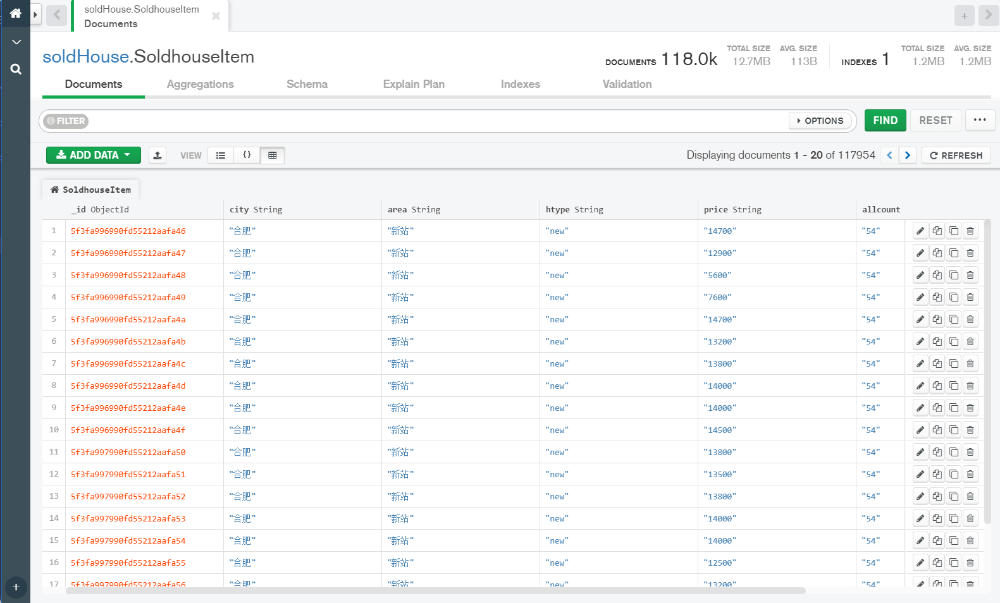
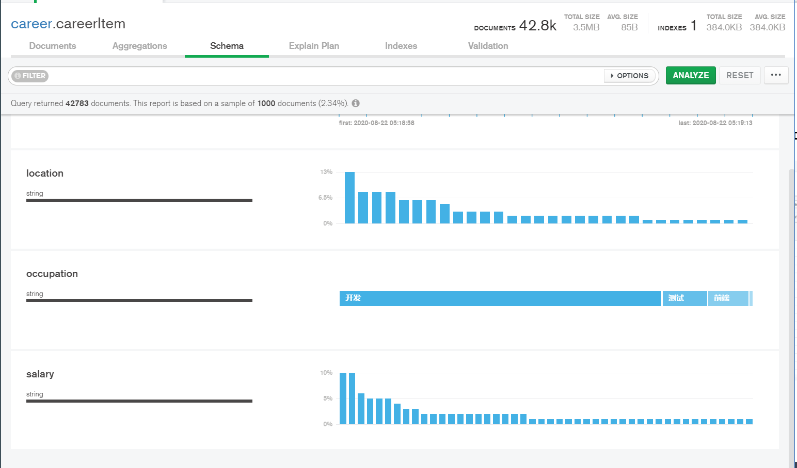
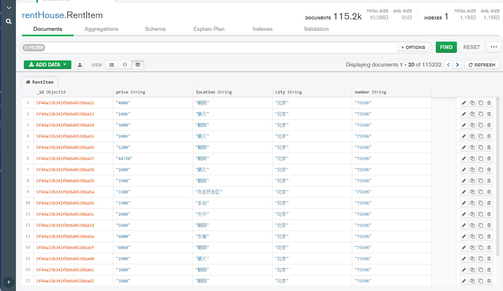
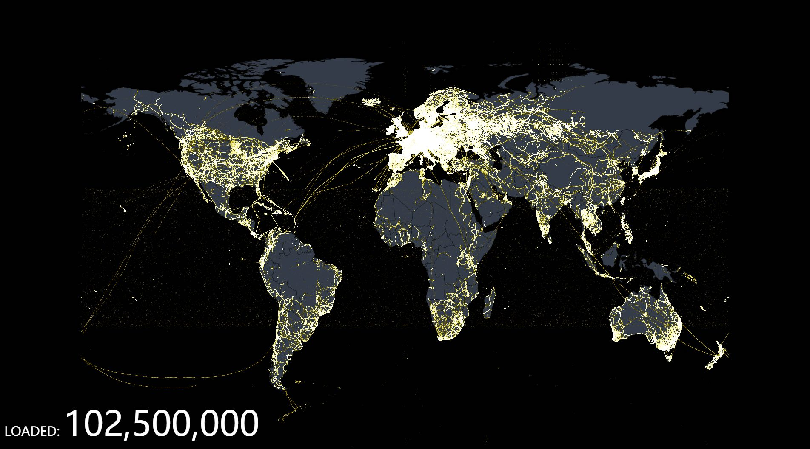

# career-and-housing-price-analysis-platform

***

## 一、数据爬取

### 1. 新房与二手房销售数据爬取

* **爬取网址**:  <https://www.ke.com/city/>
* **爬取范围**:  全国三十多个省的**省会城市**以及部分非省会**热门城市**。
* **数据存储**:  存入阿里云(Ubuntu16.04)服务器上已经配置好的**MongoDB**数据库上
* **数据数量**： 共计*117955*条数据。  

### 2. 职业数据爬取

* **爬取网址**:  <https://www.jobui.com/>、 <https://www.liepin.com/>
* **爬取范围**: 全国三十多个省的**省会城市**以及部分非省会**热门城市**。
* **数据存储**:  存入阿里云(Ubuntu16.04)服务器上已经配置好的**MongoDB**数据库上
* **数据数量**： 各地职业需求数据共计*162*条,各地职业薪资数据共计*42784*条。

### 3. 租房数据爬取

* **爬取网址**:  <https://bj.zu.ke.com/zufang/>
* **爬取范围**: 全国三十多个省的**省会城市**以及部分非省会**热门城市**。
* **数据存储**:  存入阿里云(Ubuntu16.04)服务器上已经配置好的**MongoDB**数据库上
* **数据数量**： 共计*115149*条数据。

## 二、Spark大数据处理

### 1. Mapper

&emsp;&emsp;可以看出整个代码是比较简单的，在**Mapper**里面主要是对给出的原始数据进行处理，此处是分开每个字母，然后以字母为*key*，以个数为*value*。当然，每个这样一个键值对的*value*初始值都是为*1*.

&emsp;&emsp;首先原始数据是一个大数据，可能来自不同的节点或者多个磁盘，首先**Mapper**处理的数据如果是在当前节点肯定比在其他节点的速度要快，因为如果不在同一个节点，那么就会受到网络带宽的限制。这就是在《Hadoop权威指南》里面指出的数据局部性优化。**hadoop**拿到原始数据做的第一件事就是分块，将大数据分成多个块，而每个块的大小最理想情况是默认的*64M*，那么每个块就会启动一个**Mapper**任务，那么这里就体现了**hadoop**在**Mapper**端的并行操作。先是将原始数据进行分块，然后通过块的个数来并行执行**Mapper**任务。这样相比一个线程在处理整个原始数据的速度肯定快。注意：在mapper处理后的数据不会直接存储在*hdfs*上面，因为**Mapper**处理的结果并不是最终的数据，他只是一个中间数据，那么这些数据就存储在本地的临时文件中，当执行问**Mapper**操作之后将进行删除。这里就是**Mapper**的多线程执行的操作。

### 2. Reduce

&emsp;&emsp;在**Mapper**中不对字母进行统计，只是进行一个简单的处理，总的来说：**Mapper**只是将一些非结构化或者是半结构化的数据进行了一定的结构化处理。那么在**Reduce**中进行的则是对**Mapper**处理后的数据进行分析。

&emsp;&emsp;上面对**Mapper**分块进行了简单的介绍，现在就**Reduce**进行相关的介绍。上面给出过描述，**Reduce**是处理**Mapper**处理之后的数据。那么**Reduce**的整体执行肯定是在所有的**Mapper**任务执行完之后再执行的，不然可能会导致数据的不完整。所以可以想象，在mapper执行完之后，有一个收集所有**Mapper**任务执行的结果操作。然后将收集好的完整数据转移给**Reduce**进行再次处理。那么**Reduce**是不是可以和**Mapper**一样进行并行的处理呢？答案是肯定的。但是**Reduce**的任务个数，本人暂时还没了解到，后面将会给出相关的解释。**Mapper**执行完之后会产生很多中间数据，那么**hadoop**收集好这些中间数据之后将会交给**Reduce**进行处理。当面hadoop也可以对这些中间数据进行分块处理。对中间数据进行分块，并且每个键的所有值必须在同一个块中，这个是**hadoop**在此处分块的必须条件，不然会导致处理结果的错误。那么**Reduce**处理完毕之后将会统一提交给**hdfs**来进行存储。下面给出几个先关的数据走向图，看完之后应该会更加的清晰。

## 三、数据平台搭建与数据分析展示

### 1. 前端技术栈

&emsp;&emsp;**ECharts**，一个使用 **JavaScript** 实现的开源可视化库，可以流畅的运行在 PC 和移动设备上，兼容当前绝大部分浏览器（IE8/9/10/11，Chrome，Firefox，Safari等），底层依赖矢量图形库 ZRender，提供直观，交互丰富，可高度个性化定制的数据可视化图表。

&emsp;&emsp;**ECharts** 提供了常规的折线图、柱状图、散点图、饼图、K线图，用于统计的盒形图，用于地理数据可视化的地图、热力图、线图，用于关系数据可视化的关系图、treemap、旭日图，多维数据可视化的平行坐标，还有用于 BI 的漏斗图，仪表盘，并且支持图与图之间的混搭。

&emsp;&emsp;除了已经内置的包含了丰富功能的图表，**ECharts** 还提供了自定义系列，只需要传入一个**renderItem**函数，就可以从数据映射到任何你想要的图形，更棒的是这些都还能和已有的交互组件结合使用而不需要操心其它事情。

### 2. 后端技术栈

&emsp;&emsp;**Spring Boot**可以轻松地创建独立的，基于生产级别的基于Spring的应用程序，可以“just run”它们。是目前热度最高的**Java**语言的**Web**后端框架。

* 创建独立的**Spring**应用程序

* 直接嵌入**Tomcat**，**Jetty**或**Undertow**（无需部署WAR文件）

* 提供非常简单的“入门”依赖项，以简化构建配置

* 尽可能自动配置**Spring**和**3rd Party**库

* 提供可用于生产的功能，例如指标，运行状况检查和外部化配置

* 完全没有代码生成，也不需要XML配置

